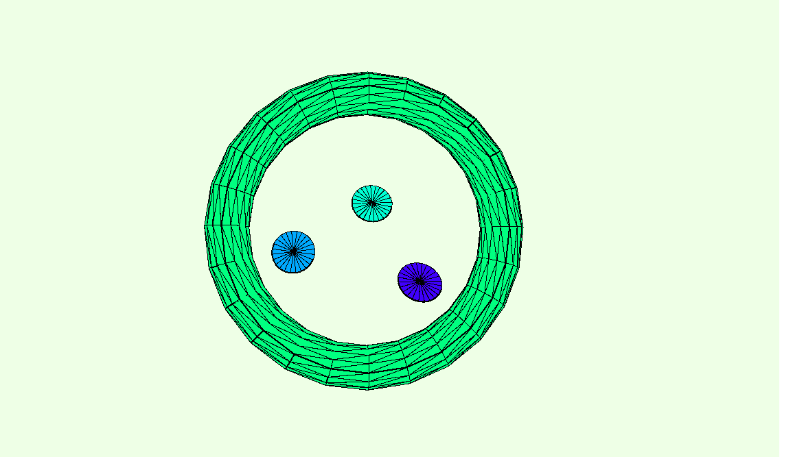

https://rawgit.com/Cathrinebp/mini_exes/master/mini_ex1/empty-example/index.html

I have been programming a bit before, so my first thought was, that it was going to be an easy task. 
The first thing I did was reading the get-started guide, and after that, I tried to program the examples and task shown. I found this really easy, and fun, so I could not wait to try and create something myself. 

Before programming, I was looking through the reference page, and tried to understand all the different codes and functions. I tried to create some simple shapes, and then I kept adding different functions to the elements. For my assignment, I had a lot of ideas to how I could make something fun and advanced. After a couple of minutes, I got really frustrated, as the formulas didn’t work the way I wanted them to. My plans for the assignment changed several times, and in the end, I just went with some random circles, instead of my original plan to create something that looks like something real, a face for example. I found myself frustrated once again, as a tried to color my objects. This time I was determined to get the circles in different colors, so I read and tried all the references I could find, and after some time I managed to color them in the colors I wanted. 

I missed the lectures and instructor classes due to sickness, so I found the oploading process really hard, and overwhelming. I had no idea where to begin. So, I waited to our instructor class on Friday, and asked the others in my study group for help. After some technical issues, I succeeded in uploading all the necessary files. 

I find the coding process really similar to both reading and writing a text. Often when I write an essay, I get the facts and inspiration from things that have already been written. It is the same with coding. Someone has already written the codes and guidelines, but it is up to the individual person, to change and interpret them, for them to fit to their given assignment and vision. 

I think that the coding practice is going to grow bigger and bigger over the years. As long as we live in a digitalized word, we need codes to create the needed content.  
