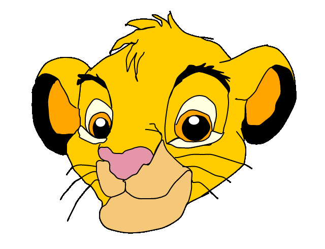

 

My program is a drawing of Simba. For this drawing I have created my own shapes, using beginShape, endShape and curveVertex. 
Before starting the project I used some time figuring out what i wanted to draw, and after some time i decided on Simba, because I knew it would be time consuming, and it would challenge me in different ways. 
After some time and some failure and succes in my proces, I got the hang of it, and i found i way for me, to do it as efficient as possible. 
About myself, i learned, that when I decide on something, I am going to do it, and do it as good as i can. 

My program is not something you can interact with, and it is basically just a picture, but the way this implements fun, is because of the motiv. The motiv for my drawing is, as mentioned, Simba, who is the main character of disneys the lion king. People seeing this will most likely associate Simba with good and fun memories from their childhood, from the times where we just had fun, and didn’t have to worry about problems and responsibility. 
This picture/program, brings people back to their memories, so that they experience the fun they once had, once again. 
