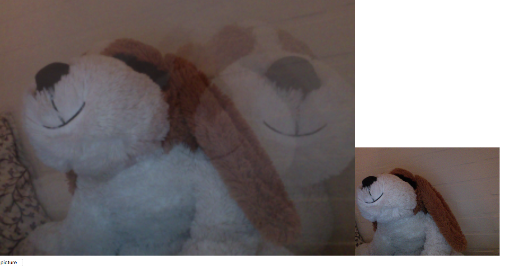

 

https://rawgit.com/Cathrinebp/mini_exes/master/mini_ex4/empty-example/index.html

My work is really simple. It works like a webcam. At the right you can see yourself, and when you press the “picture” button, the picture is shown on the big canvas to the left. The pictures are a bit see-through, so when you take a new picture, it creates this ghost effect with both (or more) pictures shown on the canvas. 
I have used some different syntaxes and a couple of variables to create the button, and the function that allows the user to take a picture, and here after project it on the screen. To create the ghost effect I have assigned the picture an alpha value. 

When the user has taken a picture, it is not possible for them to clear the screen (unless they refresh the site). So when they decide to press the button and take a picture, this picture will stay on the site, and when you take another one, it is possible to see the process or the change that has been made between the two pictures. I think that my program in a simple way shows that when the user submits something to the internet, it stays there, and it is possible for others to use that data to their advantage. There is no clear button, so when the user submits some data, the data is on the internet, and it is out of the users hands, and therefor it is not possible to delete the data completely. It might have disappeared from the users computer and Facebook page, but it still exist somewhere out there. 
I have used the ghost effect to show, that the data you submit, can create a image and understanding about where you came from before you got the a certain place, and also where you went afterwards. 
