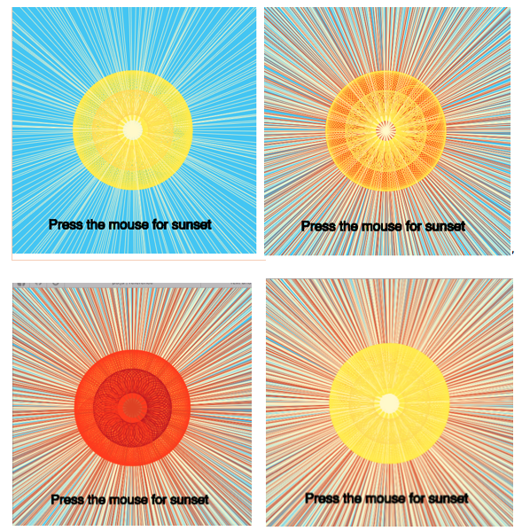

  

https://rawgit.com/Cathrinebp/mini_exes/master/mini_ex6/empty-example/index.html

Rules: 
- create two ellipses and a line and make them rotate, so they create an illusion of the sun
- Change the color to red when the mouse is pressed 
- Change the color back to yellow when the mouse is released 
- Create a text informing the user of this possibility 

(I totally forgot to create a for-loop….woops) 

My program illustrates the sun and it is basically just two ellipses and a line rotating in the middle. Over time the illustrating gets more and more compact, as more figures are drawn. If the user doesn’t press the mouse, the generatively might be hard to see after some time. But, if the user presses the mouse, it is easy for them to see how this illustration is created, and how the different figures moves. 

This exercise has helped me gain a better understanding of generatively by creating the rules a had to follow when i created the program. So, already before I created the final draft of my program, I had to reflect over the different ways I could give my program the feel of generatively. 
Because the user can interact with my program, and change the outcome of it, you can start to question who the author of my program really is. Is it me, who created this code, or is it the user who can change the outcome of it ?

