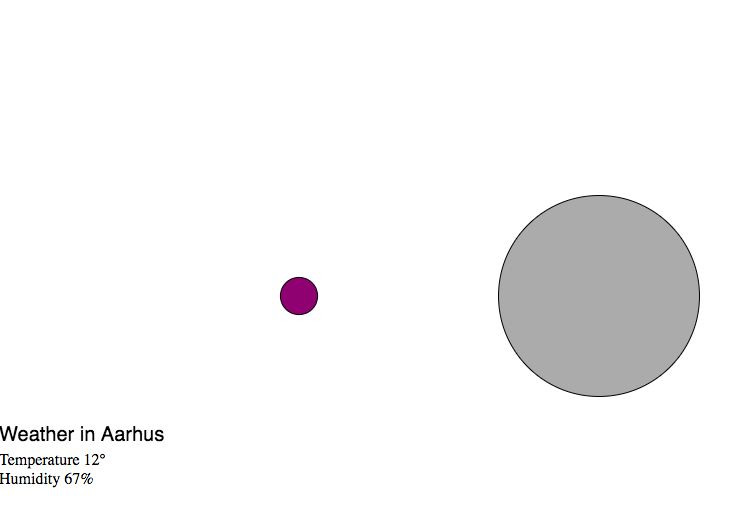

# Temperature and humidity in Aarhus 

I made this program in collaboration with Mathilde Friis Nielsen

  

https://rawgit.com/Cathrinebp/mini_exes/master/mini_ex8/empty-example/index.html

The link doesnt work correctly 

## About the program

Our program consist of two circles; one circle informing the user about the temperature and the other circle informing the user about the humidity. The size of the circles is controlled by the value of each parameter. So for the temperature, the bigger the circle is, the hotter the temperature is. 
The value is also displayed in the colors of the circle. We have used the syntax “map” to create a radiance of color. The range for the humidity circle is the grey scale, so if the humidity is exactly 0 the circle is entirely black, and if it is exactly 100 the circle is white, every value in between is displayed as some form of grey. The color scale for the temperature circle is going from blue to red, because we associate the blue color with cold weather, and the red color with warm weather. If the value is somewhere in the middle,  the color seems to be some sort of purple, because the two colors are combined. 

Our program is highly based on Daniel Shiffman’s video, as we had a hard time creating our own program entirely from scratch. Therefor we have also used the same API as him, but we have changed the city from London to Aarhus. 

## The process 
This is by far the hardest mini_ex for me to make. Mathilde and I was so confused about the concept that is API’s, and we had no idea where to start with this assignment. We found it difficult and frustrating to find the correct API’s and even harder to understand how we could use them, and illustrate them in our program. 
At first we talked about using an API from facebook, but then we didn’t know what data we wanted to use in our program, because we didn’t really know what data was available and how it was grouped. 
We started to look at different examples where they had used a weather API, and this helped is understanding how the grouping of data works. We played around with this for some time, and tried to find our own weather API’s and change as much data as we could, to get a better understanding of this. 
I feel like a have a good understanding about what an API is and how it can be used, but I am still a bit confused about the technical aspect of it. 

## Questions 
When I have some more time to investigate API’s, I think it would be interesting to see if you can combine different API’s, and maybe take a further look into what data the different API’s are providing, and what they may be hiding, or not displaying. 
