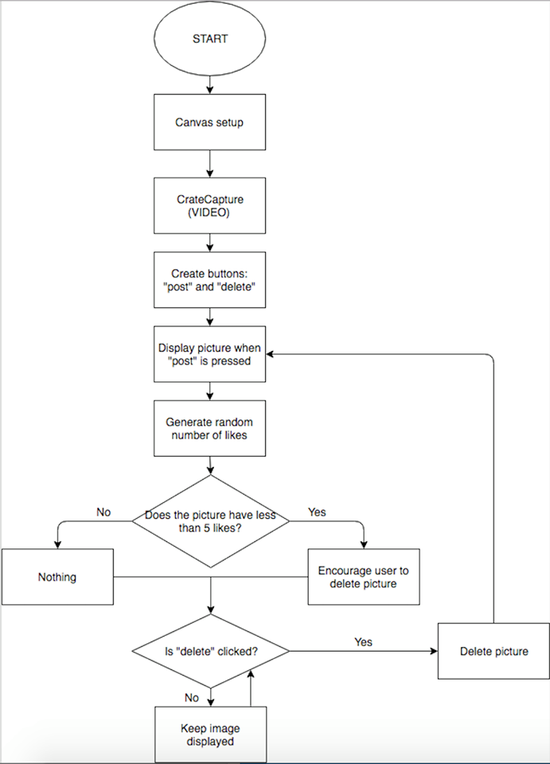

# Mini_ex5 Flowchart

I don’t really think that any of my codes are that complex. But i choose to make a flowchart illustrating my code for [Mini_ex5](https://github.com/Cathrinebp/mini_exes/tree/master/mini_ex5)
I was a bit difficult to decide on what i wanted to include, and in how i wanted to structure it. I am still not sure if I think that my flowchart illustrates my program in the best way possible. I am not sure about the last part of the flowchart, but because I am the creator I fully understand it, I am just not sure if everyone else would. 

  

# Final project flowchart 

The Female Body
The idea of this program is a generative set of sentences that describe different kind of female bodies, but always end by declaring that the body is beautiful and feminine (or something like that). The sentences will follow a formula for how the sentences are structured to make sure they make sense. The text will be divided into verses constructed of three or four sentences. When the fourth verse has been generated the screen will clear and a new set of verses will be generated

  

## Data capture

The second idea is about data capture using the webcam. We want to create two buttons; a “post” button and a “delete” button. When clicking the “post” button, the picture is posted in the side of the screen. The program will then randomly give the pictures likes. If a picture has less than 5 likes, a text will appear encouraging you to delete this picture. If you click the “delete” button the picture will be deleted and if not it will be kept.

  

The balance between simplicity and complicity in our two ideas for our final project, is so that our coded program is made quite simple, whereas our conceptual thoughts about our programs is more complex. We have worked out our ideas by starting with a conceptual idea and theme, and thereby we have brainstormed ideas to illustrate our statements in a simple way. 

## Technical challenges 

The technical challenges for our idea about the generativity project, might be to make the text appear the way we want to, and make it generate some sentences that all makes sense, and display them in a speed that makes it possible for the reader to read them properly before they disappear. 

In the other idea about data capture, the technical challenge might be to get our ideas about the like selection and the buttons to work intentionally so that our conceptual idea gets visualized.  

## The role of the flowchart 
I think that the role of the flowchart in the to projects are very different. The flowchart for my mini_ex5 its mostly aimed towards the people who hasn’t programmed the program, but are interested in how it works. The flowchart helps me to reflect on what I made my program do, and how I told it do execute the function, but this flowchart doesn’t help me create a program, as the program was already created when I made it. 
The role of the other flowchart was to help my group to structure the way we want our program to work, and this can help us when we start to program, because we already have the same visual look on how our program is going to function. The flowchart is the backbone of this program, as we use it to create the program. 

## Algorithms 

